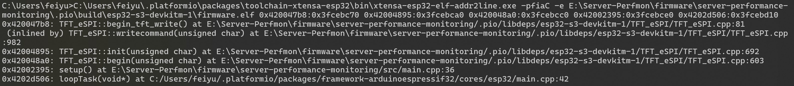

背景：芯片模组ESP32-S3 N16R8，开发工具组合Platform IO+CLion。

## 一、错误分析

硬件代码开发过程中遇到崩溃，ESP32无限重启，串口监视工具输出Backtrace信息如下：

```
ESP-ROM:esp32s3-20210327
Build:Mar 27 2021
rst:0x1 (POWERON),boot:0xb (SPI_FAST_FLASH_BOOT)
SPIWP:0xee
mode:DIO, clock div:1
load:0x3fce3808,len:0x4bc
load:0x403c9700,len:0xbd8
load:0x403cc700,len:0x2a0c
entry 0x403c98d0
Guru Meditation Error: Core  1 panic'ed (StoreProhibited). Exception was unhandled.

Core  1 register dump:
PC      : 0x420047bb  PS      : 0x00060c30  A0      : 0x82004898  A1      : 0x3fcebc70  
A2      : 0x00000010  A3      : 0x00000000  A4      : 0x60004000  A5      : 0x00000008  
A6      : 0x000000ff  A7      : 0x00000001  A8      : 0x08000000  A9      : 0x3fcebc40  
A10     : 0x3fcab108  A11     : 0x00000001  A12     : 0xffffffff  A13     : 0x00008000  
A14     : 0x00000000  A15     : 0x3fc97384  SAR     : 0x00000010  EXCCAUSE: 0x0000001d  
EXCVADDR: 0x00000010  LBEG    : 0x42096724  LEND    : 0x42096788  LCOUNT  : 0x00000000  


Backtrace: 0x420047b8:0x3fcebc70 0x42004895:0x3fcebca0 0x420048a0:0x3fcebcc0 0x42002395:0x3fcebce0 0x4202d506:0x3fcebd10


ELF file SHA256: 6b068cae5d99a1f0

Rebooting...
```

这些信息较为笼统，不能对应到确切的代码，此时可以使用工具 `xtensa-esp32-elf-addr2line.exe` 对错误信息进行具体定位，映射到代码中的具体行，在我的开发环境中，此工具所在目录如下：

```
C:\Users\<你的计算机用户名>\.platformio\packages\toolchain-xtensa-esp32\bin\xtensa-esp32-elf-addr2line.exe
```

如果你不能定位到此工具的具体路径，推荐使用Everything文件索引工具对计算机进行全局搜索，快速定位。


除上述工具文件外，还需要找到写入MCU的固件.elf文件路径。在你的Platform IO项目中，定位到以下：

```
.pio\build\esp32-s3-devkitm-1\firmware.elf
```

同样推荐使用Everything进行快速搜索定位。

分析工具使用方法如下：

```cmd
<工具所在目录绝对路径>\xtensa-esp32-elf-addr2line.exe -pfiaC -e <写入MCU的elf固件绝对路径>\firmware.elf <Backtrace信息>
```

具体示例：

```cmd
C:\Users\feiyu\.platformio\packages\toolchain-xtensa-esp32\bin\xtensa-esp32-elf-addr2line.exe -pfiaC -e E:\test\.pio\build\esp32-s3-devkitm-1\firmware.elf 0x420047b8:0x3fcebc70 0x42004895:0x3fcebca0 0x420048a0:0x3fcebcc0 0x42002395:0x3fcebce0 0x4202d506:0x3fcebd10
```



上图中的错误信息来自文章开头提到的错误信息，由此定位到导致崩溃的代码的绝对位置。

## 二、问题解决

由Backtrace分析结果可以得到，是 `TFT_eSPI::begin_tft_write()` 函数导致的崩溃。报错：`Guru Meditation Error: Core  1 panic'ed (StoreProhibited). Exception was unhandled.`

多次检查代码未能找到错误原因，经检索得出：这个问题是由于**esp32核心版本为2.0.16**，而ESP32-S3下的TFT_eSPI库并不适配，产生兼容性问题。

解决方法：在 `platformio.ini` 中指定espressif32版本，将esp32核心版本回退到2.0.14。

```ini
[env:esp32-s3-devkitm-1]
platform = espressif32 @ 6.6.0
board = esp32-s3-devkitm-1
framework = arduino
```

