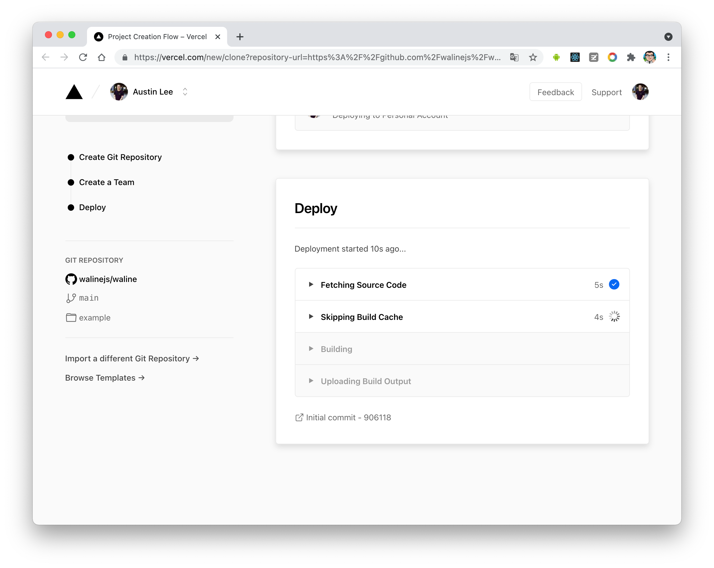
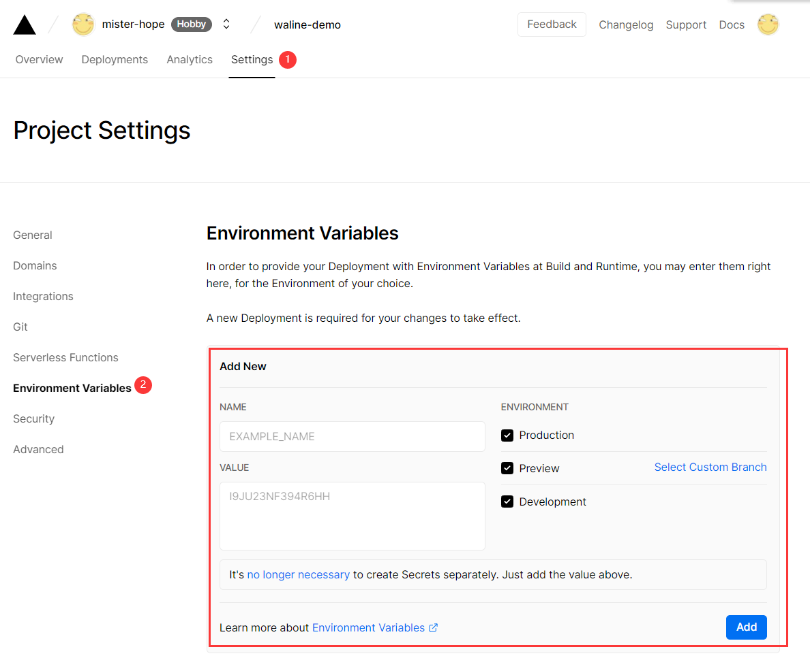
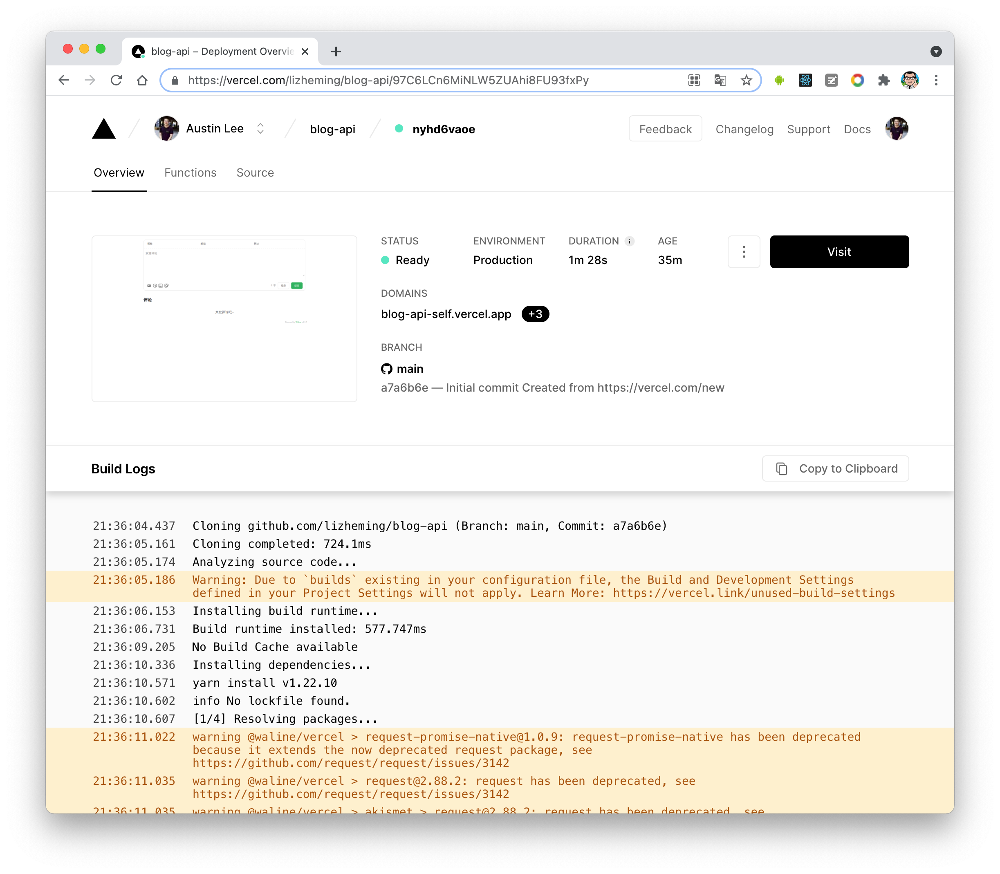
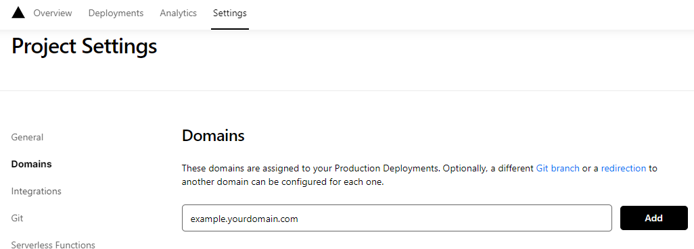
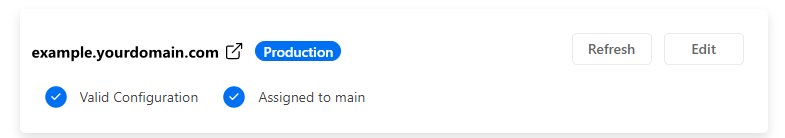

import { Steps, Aside, Tabs, TabItem } from 'astro-pure/user'

# Astro个人博客搭建

## Installation

Environment requirements:

- [Nodejs](https://nodejs.org/): 18.0.0+

### Install Using Fork
You only need to [click fork button at theme repository](https://github.com/cworld1/astro-theme-pure/fork) to create your project; then clone the forked repository to your local machine.

```shell
git clone https://github.com/<your-username>/astro-theme-pure.git
cd ./<your-project>
bun install
```

Then, you can start the Astro dev server and see a live preview of your project while you make it your own!

## Start the Dev Server

Go to your project directory:

```shell
cd ./<your-project>
bun dev
```

## Simple Setup


<Steps>

1. Remove docs files

   - Remove the `src/pages/docs` directory
   - Remove the menu declaration in `src/site.config.ts`:

   ```ts title="src/site.config.ts"
   export const theme: ThemeUserConfig = {
      // ...
      /** Configure the header of your site. */
      header: {
         menu: [
            { title: 'Blog', link: '/blog' },
            { title: 'Docs', link: '/docs' }, // [!code --]
            // ...
         ],
      },
   }
   ```

   - Remove the Content Collection for docs in `src/content.config.ts`:

   ```ts title="src/content.config.ts"
   const docs = defineCollection({ // [!code --]
   loader: glob({ base: './src/content/docs', pattern: '**/*.{md,mdx}' }), // [!code --]
   schema: ({ image }) => // [!code --]
      z.object({ // [!code --]
         ... // [!code --]
      }) // [!code --]
   }) // [!code --]
   export const collections = { blog, docs } // [!code --]
   export const content = { blog } // [!code ++]
   ```

2. Remove `packages` directory (this will be imported by our NPM package)

3. Change the site favicon.

   <Aside type='tip'>
   [Favicon.io](https://favicon.io/) is a great tool that can help you generate favicons quickly.
   </Aside>


   Replace the `public/favicon/*` files with your own favicon.

4. Replace your avatar image.

   Replace the `src/assets/avatar.png` file with your own avatar image.

5. Configure the site

   You can configure your project inside the `src/site.config.ts` configuration file:

   ```ts title="src/site.config.ts"
   export const theme: ThemeUserConfig = {
      author: 'CWorld',
      title: 'Astro Theme Pure',
      site: 'https://astro-pure.js.org',
      description: 'Stay hungry, stay foolish',
      // ...
   }
   
   export const integ: IntegrationUserConfig = { /* ... */ }
   // ...
   ```

6. Typescript Syntax

   The configuration file `site.config.ts` uses Typescript syntax. If you are not familiar with TS syntax, please read about it [here](https://learnxinyminutes.com/docs/typescript/) first.

</Steps>

## Deployment Mode

<Aside type='tip'>
Astro had a very fantastic support for deployment. Check [Deploy your Astro Site](https://docs.astro.build/en/guides/deploy/) for more.
</Aside>


### Vercel

This theme supports Vercel by default:

<Steps>

1. Push your code to your online Git repository (GitHub, GitLab, BitBucket).
2. [Import your project](https://vercel.com/new) into Vercel.
3. Vercel will automatically detect Astro and configure the right settings.
4. Your application is deployed! (e.g. [astro.vercel.app](https://astro.vercel.app/))

</Steps>

And vercel also support static method:

```ts title="astro.config.mjs"
import vercelServerless from '@astrojs/vercel/serverless' // [!code --]
import vercelStatic from '@astrojs/vercel/static'; // [!code ++]

export default defineConfig({
  //   ...
  adapter: vercelServerless() // [!code --]
  adapter: vercelStatic(), // [!code ++]
})
```

### Using Vercel with a custom domain

Vercel Dashboard -> your-project -> Settings -> Domains

Edit your domain and save, configure your DNS settings automatically.

## Waline Comment System

<Aside>
  This theme has integrated the Waline comment system. You can configure it at the
  `integrationConfig.waline` in file `src/site.config.ts`.
</Aside>


The theme's comment, read statistics, likes, and other functionalities are all provided by [Waline](https://waline.js.org/).

### Deploy

You can refer to [its documentation](https://waline.js.org/guide/get-started/) for configuration, and it is recommended to use the Vercel + Lean combination.

#### LeanCloud 设置 (数据库)

1. [登录](https://console.leancloud.app/login) 或 [注册](https://console.leancloud.app/register) `LeanCloud 国际版` 并进入 [控制台](https://console.leancloud.app/apps)

2. 点击左上角 [创建应用](https://console.leancloud.app/apps) 并起一个你喜欢的名字 (请选择免费的开发版):

   创建应用

3. 进入应用，选择左下角的 `设置` > `应用 Key`。你可以看到你的 `APP ID`,`APP Key` 和 `Master Key`。请记录它们，以便后续使用。

   ID 和 Key

#### Vercel 部署 (服务端)

[](https://vercel.com/new/clone?repository-url=https%3A%2F%2Fgithub.com%2Fwalinejs%2Fwaline%2Ftree%2Fmain%2Fexample)Vercel

1. 点击上方按钮，跳转至 Vercel 进行 Server 端部署。

   注

   如果你未登录的话，Vercel 会让你注册或登录，请使用 GitHub 账户进行快捷登录。

2. 输入一个你喜欢的 Vercel 项目名称并点击 `Create` 继续:

   创建项目

3. 此时 Vercel 会基于 Waline 模板帮助你新建并初始化仓库，仓库名为你之前输入的项目名。

   deploy

   一两分钟后，满屏的烟花会庆祝你部署成功。此时点击 `Go to Dashboard` 可以跳转到应用的控制台。

   deploy

4. 点击顶部的 `Settings` - `Environment Variables` 进入环境变量配置页，并配置三个环境变量 `LEAN_ID`, `LEAN_KEY` 和 `LEAN_MASTER_KEY` 。它们的值分别对应上一步在 LeanCloud 中获得的 `APP ID`, `APP KEY`, `Master Key`。

   设置环境变量

5. 环境变量配置完成之后点击顶部的 `Deployments` 点击顶部最新的一次部署右侧的 `Redeploy` 按钮进行重新部署。该步骤是为了让刚才设置的环境变量生效。

   redeploy

6. 此时会跳转到 `Overview` 界面开始部署，等待片刻后 `STATUS` 会变成 `Ready`。此时请点击 `Visit` ，即可跳转到部署好的网站地址，此地址即为你的服务端地址。

   redeploy success

#### 绑定域名 (可选)

1. 点击顶部的 `Settings` - `Domains` 进入域名配置页

2. 输入需要绑定的域名并点击 `Add`

   Add domain

3. 在域名服务器商处添加新的 `CNAME` 解析记录

   | Type  | Name    | Value                |
   | ----- | ------- | -------------------- |
   | CNAME | example | cname.vercel-dns.com |

4. 等待生效，你可以通过自己的域名来访问了🎉

   - 评论系统：example.yourdomain.com
   - 评论管理：example.yourdomain.com/ui

   success

#### 评论管理 (管理端)

1. 部署完成后，请访问 `<serverURL>/ui/register` 进行注册。首个注册的人会被设定成管理员。
2. 管理员登陆后，即可看到评论管理界面。在这里可以修改、标记或删除评论。
3. 用户也可通过评论框注册账号，登陆后会跳转到自己的档案页。

### Configuration

Then you can configure the Waline comment system in the `integrationConfig.server`.

```ts title="src/site.config.ts"
export const integ: IntegrationUserConfig = {
  // ...
  waline: {
    enable: true,
    // Server service link
    server: 'https://your-project-name.vercel.app/', // [!code highlight]
    // Refer https://waline.js.org/en/guide/features/emoji.html
    emoji: ['bmoji', 'weibo'],
    // Refer https://waline.js.org/en/reference/client/props.html
    additionalConfigs: {
      pageview: true,
      comment: true
      // ...
    }
  }
}
```

### Usage

You can call it manually in `.astro` or `.mdx` files.

```jsx
import { Comment } from 'astro-pure/advanced'

;<Comment />
```

> 参考链接：
>
> [DOCS • Astro Theme Pure](https://astro-pure.js.org/docs/)
>
> [cworld1/astro-theme-pure: ⭐ A simple, fast and powerful blog theme built by Astro](https://github.com/cworld1/astro-theme-pure)
>
> [快速上手 | Waline](https://waline.js.org/guide/get-started/)
