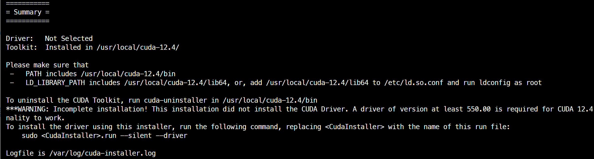

import { Steps, Aside, Tabs, TabItem } from 'astro-pure/user'

## 1. 硬件篇

- **CPU**：AMD Epyc 7k62
- **GPU**：Tesla V100-SXM2-16GB
- **内存**：Samsung 64GB 4DRx4 PC4-2666V  *4共256GB
- **主板**：Tyan S8030GM4NE_2T
- **固态硬盘**：PBlaze6 6531 3.84T
- **电源**：振华 Leadex III 1000W ATX3.1
- **散热器**：CPU：U14S AMD-SP3    GPU：串联360水冷  
- **机箱**：追风者PK620PC


## 2. 系统篇

### 2.1 安装Ubuntu 22.04系统

1. 在官网下载Ubuntu镜像：Ubuntu 22.04.5 LTS (Focal Fossa)，选择**Desktop Image**版本，得到.iso的镜像文件。

2. Windows下使用Ventoy工具制作系统启动盘，将.iso镜像文件写入U盘。

3. 将U盘插到服务器上，开机按`del键`（具体什么键跟主板型号有关）选择启动项进入临时的Ubuntu系统，在图形界面中选择**Install Ubuntu**，所有配置都可以使用默认的，改一下用户名和密码即可。建议使用英文作为默认语言。

   安装过程中会联网下载一些软件包更新，可以直接点skip掉，在安装好系统之后再手动更新也是一样的。

4. 进入系统后设置一下root账户密码：

```sh
sudo passwd root
```

5. 同时为了避免每次sudo都要输入密码，这里配置一下`visudo`：

```sh
sudo visudo
```

`visudo` 命令会使用系统默认的文本编辑器打开 `/etc/sudoers` 文件。注意，不要改动其他内容，因为这可能会导致系统问题。

在打开的 `sudoers` 文件中找到这样一行：

```
%sudo   ALL=(ALL:ALL) ALL
```

在这一行的下方添加以下内容，用于指定某个用户执行 `sudo` 命令时无需输入密码：

```
username ALL=(ALL) NOPASSWD: ALL
```

其中，`username` 是你希望免密执行 `sudo` 命令的用户名。

在完成编辑后，保存并退出文本编辑器。如果你使用的是默认的文本编辑器 nano，按下 `Ctrl + X` 键，然后按 `Y` 键确认保存，并按回车键确认文件名。

在终端中，尝试执行一个需要管理员权限的命令，例如：

```bash
sudo ls /root
```

如果你配置正确，将无需输入密码，即可执行该命令。

### 2.2 配置国内镜像软件源

#### 备份原有源文件

在修改源之前，最好先备份一下原来的源文件，以防出现问题可以恢复。

```bash
sudo cp /etc/apt/sources.list /etc/apt/sources.list.bak
```

#### 选择国内源并修改源文件

打开 `/etc/apt/sources.list` 文件进行编辑，可以使用 `nano` 或 `vim` 等文本编辑器。

```bash
sudo vim /etc/apt/sources.list
```

将文件中的内容替换为以下阿里云源的内容：

```cpp
deb http://mirrors.aliyun.com/ubuntu/ jammy main restricted universe multiverse
deb-src http://mirrors.aliyun.com/ubuntu/ jammy main restricted universe multiverse

deb http://mirrors.aliyun.com/ubuntu/ jammy-security main restricted universe multiverse
deb-src http://mirrors.aliyun.com/ubuntu/ jammy-security main restricted universe multiverse

deb http://mirrors.aliyun.com/ubuntu/ jammy-updates main restricted universe multiverse
deb-src http://mirrors.aliyun.com/ubuntu/ jammy-updates main restricted universe multiverse

deb http://mirrors.aliyun.com/ubuntu/ jammy-backports main restricted universe multiverse
deb-src http://mirrors.aliyun.com/ubuntu/ jammy-backports main restricted universe multiverse
```

清华源

```cpp
deb https://mirrors.tuna.tsinghua.edu.cn/ubuntu/ jammy main restricted universe multiverse
deb-src https://mirrors.tuna.tsinghua.edu.cn/ubuntu/ jammy main restricted universe multiverse

deb https://mirrors.tuna.tsinghua.edu.cn/ubuntu/ jammy-security main restricted universe multiverse
deb-src https://mirrors.tuna.tsinghua.edu.cn/ubuntu/ jammy-security main restricted universe multiverse

deb https://mirrors.tuna.tsinghua.edu.cn/ubuntu/ jammy-updates main restricted universe multiverse
deb-src https://mirrors.tuna.tsinghua.edu.cn/ubuntu/ jammy-updates main restricted universe multiverse

deb https://mirrors.tuna.tsinghua.edu.cn/ubuntu/ jammy-backports main restricted universe multiverse
deb-src https://mirrors.tuna.tsinghua.edu.cn/ubuntu/ jammy-backports main restricted universe multiverse
```

#### 更新源

保存修改后的源文件后，更新源以使其生效：

```bash
sudo apt update
```


**Ubuntu有线网络显示已连接，但出现问号：**

有线连接均已获取到IP，但暂时不能解析域名。IPv4和IPv6的DNS都设置的自动连接，有网络信号。

**解决方法：**将IPv4的DNS手动设置为114.114.114.114，断开网络后重新连接即可解决。如果依然不行，将IPv4的DNS还原成自动，网络即可恢复。

### 2.3 安装Ast2500集显驱动 (可选)

暂时未能解决分辨率低的问题

1. run "uname -r" to get the kernel version

2. disable "secure boot" in BIOS option
3. select proper deb in `Linux_DRM_1.15.1_4/DKMS` and run `sudo dpkg -i ast-drm-linux6.5.deb` for example
4. if it is failed due to dependency issue/报错“subprocess installed post-installation script returned error exit status 10”, run command: 

```bash
sudo rm /var/crash/ast-dkms.0.crash
sudo rm /var/lib/dpkg/info/ast-dkms*
sudo apt-get -f install
sudo dpkg -i ast-drm-linux6.5.deb
sudo reboot
```

### 2.4 配置SSH & 远程桌面

纯净安装的系统里面默认没有开启SSH，我们手动安装一下。

1. 安装ssh：

```bash
sudo apt install ssh
```

会自动安装好很多依赖包并启动服务，完成之后用XShell等软件就可以SSH登录服务器了

2. 安装xrdp

Xrdp 是一个微软远程桌面协议（RDP）的开源实现，它允许我们通过图形界面控制远程系统。这里使用RDP而不是VNC作为远程桌面，是因为Windows自带的远程桌面连接软件就可以连接很方便，另外RDP在Windows下的体验非常好，包括速度很快（因为压缩方案做得比较好），可以直接在主机和远程桌面之间复制粘贴等等。

安装过程如下：

```bash
sudo apt install xrdp
```

安装完成xrdp 服务将会自动启动，可以输入下面的命令验证它：

```bash
sudo systemctl status xrdp
```

默认情况下，xrdp 使用`/etc/ssl/private/ssl-cert-snakeoil.key`，它仅仅对ssl-cert用户组成语可读，所以需要运行下面的命令，将xrdp用户添加到这个用户组：

```bash
sudo adduser xrdp ssl-cert  
sudo systemctl restart xrdp
```

在桌面打开Settings应用，在Sharing中开启Remote Desktop和Remote Control选项，并设置远程桌面的账号密码。设置完成后Log Out，否则在使用 XRDP 远程连接 Ubuntu 时会遇到黑屏问题。

要注销，请单击**关机**图标并选择**注销**选项。

在系统防火墙上打开端口3389

```bash
sudo ufw allow from any to any port 3389 proto tcp
```

然后使用Windows自带的远程桌面软件连接服务器IP地址或者域名就行了。

建议在Settings-Power中禁用Screen Blank以免黑屏，Settings-Users中关闭Automatic Login，以免本地自动登录造成远程桌面黑屏。

3. 优化xrdp

**桌面外观优化**

如果不做任何配置，xrdp桌面是Gnome的原始桌面，没有左侧的任务栏，窗口也没有最小化按钮，等等一些问题。解决方案：

添加配置文件

```bash
sudo vim ~/.xsessionrc

添加：

export GNOME_SHELL_SESSION_MODE=ubuntu
export XDG_CURRENT_DESKTOP=ubuntu:GNOME
export XDG_CONFIG_DIRS=/etc/xdg/xdg-ubuntu:/etc/xdg
```

修改完成后重启xrdp服务和系统，否则会黑屏。

```bash
sudo systemctl restart xrdp.service
sudo reboot
```

**xrdp画面卡顿优化**

调整 Xrdp 配置参数： `sudo vim /etc/xrdp/xrdp.ini`，添加：

```bash
tcp_send_buffer_bytes=4194304
tcp_recv_buffer_bytes=6291456
```

`tcp_send_buffer_bytes`, `tcp_recv_buffer_bytes` 两个参数默认被注释了，注释默认值（32768），根据实际情况进行调整。

调整系统参数：`sudo vim /etc/sysctl.conf`，添加：

```bash
net.core.rmem_max = 12582912
net.core.wmem_max = 8388608
```

然后执行

```bash
sudo sysctl -p
```

修改完成后重启xrdp服务和系统，否则会黑屏。

```bash
sudo systemctl restart xrdp
sudo reboot
```

### 2.5 安装zsh

安装ohmyzsh可以美化Linux shell和Xshell

> [Windows安装Zsh终端 - 知乎](https://zhuanlan.zhihu.com/p/625583037)
>
> [zsh 安装与配置，使用 oh-my-zsh 美化终端 | Leehow的小站](https://www.haoyep.com/posts/zsh-config-oh-my-zsh/)
>
> [【zsh使用技巧】Linux shell美化，ohmyzsh安装+Xshell美化，体验Mac命令行 - 云牧青 - 博客园](https://www.cnblogs.com/yunmuq/p/15817431.html)

#### 环境配置

**安装基本工具**

```bash
# 更新软件源
sudo apt update && sudo apt upgrade -y
# 安装 zsh git curl
sudo apt install zsh git curl -y
```

设置默认终端为 zsh（**注意：不要使用 sudo**）。

```
chsh -s /bin/zsh
```

**安装 oh-my-zsh**

官网：http://ohmyz.sh/。 安装方式任选一个即可。

| Method        | Command                                                      |
| :------------ | :----------------------------------------------------------- |
| curl          | `sh -c "$(curl -fsSL https://install.ohmyz.sh/)"`            |
| wget          | `sh -c "$(wget -O- https://install.ohmyz.sh/)"`              |
| ****fetch**** | `sh -c "$(fetch -o - https://install.ohmyz.sh/)"`            |
| 国内curl镜像  | `sh -c "$(curl -fsSL https://gitee.com/pocmon/ohmyzsh/raw/master/tools/install.sh)"` |
| 国内wget镜像  | `sh -c "$(wget -O- https://gitee.com/pocmon/ohmyzsh/raw/master/tools/install.sh)"` |

注意：同意使用 Oh-my-zsh 的配置模板覆盖已有的 `.zshrc`。

#### 从`.bashrc`中迁移配置（可选）

如果之前在使用`bash`时自定义了一些环境变量、别名等，那么在切换到`zsh`后，你需要手动迁移这些自定义配置。

```bash
# 查看bash配置文件，并手动复制自定义配置
cat ~/.bashrc
# 编辑zsh配置文件，并粘贴自定义配置
nano ~/.zshrc
# 启动新的zsh配置
source ~/.zshrc
```

`root`用户在执行`sudo su`命令后，再运行上述代码查看、手动复制、粘贴自定义配置。

#### 配置主题

`Oh My Zsh` 安装之后，默认使用主题是 `robbyrussell`，可以修改 `.zshrc` 配置中的 `ZSH_THEME` 字段，所有可用主题可参考[ohmyzsh官方文档](https://link.zhihu.com/?target=https%3A//github.com/ohmyzsh/ohmyzsh/wiki/Themes)。

```bash
sudo wget -O $ZSH_CUSTOM/themes/haoomz.zsh-theme https://cdn.haoyep.com/gh/leegical/Blog_img/zsh/haoomz.zsh-theme
```

编辑 `~/.zshrc` 文件，将 `ZSH_THEME` 设为 `haoomz`。当然你也可以设置为其他主题，例如`agnoster`、`ys`、`robbyrussell`。

```bash
vim ~/.zshrc

ZSH_THEME="haoomz"

#使配置生效
source ~/.zshrc
```

**推荐主题**

你可以在[内置主题样式截图](https://github.com/ohmyzsh/ohmyzsh/wiki/Themes)中查看所有 zsh 内置的主题样式和对应的主题名。这些内置主题已经放在 ～/.oh-my-zsh/themes 目录下，不需要再下载。

```bash
cd ~/.oh-my-zsh/themes && ls
```

**安装 Powerlevel10k 主题**

根据 [What’s the best theme for Oh My Zsh?](https://www.slant.co/topics/7553/~theme-for-oh-my-zsh) 中的排名，以及自定义化、美观程度，强烈建议使用 [powerlevel10k](https://github.com/romkatv/powerlevel10k) 主题。

1. 安装并设置字体

首先下载官方推荐的字体 [字体下载](https://github.com/romkatv/powerlevel10k#meslo-nerd-font-patched-for-powerlevel10k)，下载`MesloLGS NF Regular.ttf` `MesloLGS NF Bold.ttf` `MesloLGS NF Italic.ttf` `MesloLGS NF Bold Italic.ttf`四个字体并为所有用户安装即可，如果不使用此字体，会导致很多图标无法显示。

在Xshell菜单栏中选择“文件”--“属性”--“外观”，在右侧进行“字体”设置，选择`MesloLGS NF`，然后点击“确定”。

2. 下载Powerlevel10k

```bash
git clone --depth=1 https://github.com/romkatv/powerlevel10k.git ${ZSH_CUSTOM:-$HOME/.oh-my-zsh/custom}/themes/powerlevel10k

# 中国用户可以使用 gitee.com 上的官方镜像加速下载
git clone --depth=1 https://gitee.com/romkatv/powerlevel10k.git ${ZSH_CUSTOM:-$HOME/.oh-my-zsh/custom}/themes/powerlevel10k
```

在 `~/.zshrc` 设置 `ZSH_THEME="powerlevel10k/powerlevel10k"`。

在终端执行命令更新 `.zshrc` 配置文件：

```bash
source ~/.zshrc
```

接下来，终端会自动引导你配置 `powerlevel10k`。

之后会显示可交互信息进行 `p10k` 配置，输入 `y` 之后按照自己的喜好进行配置即可，以后还想重新配置的话，可以执行命令 `p10k configure`，或修改 `p10k` 配置文件 `~/.p10k.zsh`

#### 配置插件

通过使用插件，可以让 `Zsh` 的功能更加强大，`Zsh` 和 `Oh My Zsh` 自带了一些实用的插件，也可以下载其他的插件。 如 `Zsh` 自带 `Git` 插件，可以在命令行显示 `Git` 相关的信息，并提供了一些操作 `Git` 的别名：

```text
gaa = git add --all
gcmsg = git commit -m
ga = git add
gst = git status
gp = git push
```

**自动补全**

`zsh-autosuggestions` 插件，可以在你历史指令中找到与你当前输入指令匹配的记录，并高亮显示，如果想直接使用，可以直接通过右方向键补全。 安装插件，在终端分别执行下面两条命令：

```bash
cd ~/.oh-my-zsh/custom/plugins

git clone https://github.com/zsh-users/zsh-autosuggestions ${ZSH_CUSTOM:-~/.oh-my-zsh/custom}/plugins/zsh-autosuggestions
```

插件下载完成之后，编辑 `~/.zshrc` 配置文件，修改插件相关配置项：

```bash
vim ~/.zshrc

plugins=(git zsh-autosuggestions)
```

保存退出之后，记得使用命令 `source ~/.zshrc` 重载配置。该插件生效之后，在使用命令的时候，就会匹配我们使用的命令，右键可以直接补全。

**zsh-autosuggestion颜色为白色的问题解决：**

1. 实际上应该是终端类型不支持008这个灰色, 所以直接显示白色了, 直接加到.zshrc中

```bash
echo "export TERM=xterm-256color" >> ~/.zshrc
```

之后`source ~/.zshrc`之后就可以了

2. 修改颜色值。编辑.zshrc文件

```bash
vim ~/.zshrc
```

在最后一行追加:

```bash
ZSH_AUTOSUGGEST_HIGHLIGHT_STYLE='fg=yellow'
```

可以支持的颜色有限：
black , red , green , yellow , blue , magenta , cyan and white

之后`source ~/.zshrc`之后就可以了

3. 在github的issue讨论中可以看到这个插件与`zsh-syntax-highlighting`冲突了。每当`source .zshrc`的时候就会出现这个情况。建议使用`exec zsh`来代替。或者注释掉冲突的插件。

**目录跳转**

Zsh 自带有一个插件 z，可以让我们在访问过的目录中快速跳转，将该插件配置到 ~/.zshrc 文件中即可使用：

```bash
vim ~/.zshrc

plugins=(git zsh-autosuggestions z)
```

保存退出之后，重载配置，随意进入一些目录，之后再使用命令 `z` 就可以实现快速跳转，支持模糊匹配。

**zsh-syntax-highlighting**

[zsh-syntax-highlighting](https://github.com/zsh-users/zsh-syntax-highlighting) 是一个命令语法校验插件，在输入命令的过程中，若指令不合法，则指令显示为红色，若指令合法就会显示为绿色。

安装方式：把插件下载到本地的 `~/.oh-my-zsh/custom/plugins` 目录

```bash
git clone https://github.com/zsh-users/zsh-syntax-highlighting.git ${ZSH_CUSTOM:-~/.oh-my-zsh/custom}/plugins/zsh-syntax-highlighting

vim ~/.zshrc

plugins=(git zsh-autosuggestions z zsh-syntax-highlighting)
```

**extract**

`oh-my-zsh` 内置了 `extract` 插件。`extract` 用于解压任何压缩文件，不必根据压缩文件的后缀名来记忆压缩软件。使用 `x` 命令即可解压文件。

```bash
vim ~/.zshrc

plugins=(git zsh-autosuggestions z zsh-syntax-highlighting extract)

x example.tar.xz
```

### 2.6 安装ZeroTier进行内网穿透

####  1. ZeroTier 的 Linux 安装脚本

如果依靠 SSL 来验证站点，则可以通过以下方式完成安装：

```bash
curl -s https://install.zerotier.com | sudo bash
```

如果安装了 GPG，则可以使用更安全的选项：

```bash
curl -s 'https://raw.githubusercontent.com/zerotier/ZeroTierOne/main/doc/contact%40zerotier.com.gpg' | gpg --import &amp;&amp; \
if z=$(curl -s 'https://install.zerotier.com/' | gpg); then echo "$z" | sudo bash; fi
```

 **ZeroTier 的 Linux 更新脚本**

如果使用上述 ZeroTier 的 linux 安装脚本，它会将 repo 添加到您的系统。使用 apt 或 yum 更新 zerotier-one。

例如，在基于 debian/ubuntu 的系统上（ centos 系统需要将 apt 替换为 yum ）：

查看可更新软件：

```bash
sudo apt update
```

更新 ZeroTier

```bash
sudo apt install zerotier-one
```

提示 ：各客户端的版本应尽量保持一致

#### 2. 加入一个网络

**加入网络**

首先在要连接的Linux设备上输入如下命令加入网络，如果连接成功就会出现 200 join OK 的状态码提示：

```bash
sudo zerotier-cli join <Network ID>
```

**查看当前连接**

在zerotier认证该设备。如果列表中出现 Network ID、Name 说明连接成功，后台分配好IP后再查看IP地址也会出现。

```bash
sudo zerotier-cli listnetworks
```

#### 3. 常用操作

zerotier 服务 手动启动：

```bash
# 返回信息 “200 info ########### 1.10.6 ONLINE”
sudo zerotier-cli status
```

zerotier 服务 手动启动：

```bash
sudo systemctl start zerotier-one.service
```

zerotier 服务 开机自启动：

```bash
# 开机自启动，成功怎返回值的最后会有“enable zerotier-one”字样
sudo systemctl enable zerotier-one.service
```

zerotier 服务 查看本机连接的网络：上面有提过---查看当前连接

```bash
# 查看当前连接的网络，如果列表中出现 Network ID、Name 说明连接成功，后台分配好IP后再查看IP地址也会出现。
sudo zerotier-cli listnetworks
```

zerotier 服务 加入网络：

```bash
# 加入网络命令，操作成功则返回 “200 join OK”
sudo zerotier-cli join <Network ID>
```

zerotier 服务 断开当前加入的网络：

```bash
# 断开网络命令，操作成功则返回 “200 leave OK”
sudo zerotier-cli leave <Network ID>
```

zerotier 服务 停止

```bash
sudo systemctl stop zerotier-one
```

或者

```bash
sudo service zerotier-one stop
```

 zerotier 服务 重启服务

```bash
sudo systemctl start zerotier-one
```

或者

```bash
sudo service zerotier-one start
```

#### 4. 卸载命令

**ubuntu、Debian 卸载 zerotier**

```bash
sudo dpkg -P zerotier-one
sudo rm -rf /var/lib/zerotier-one/
```

**CentOS、Redhat 卸载 zerotier**

```bash
sudo rpm -e zerotier-one
sudo rm -rf /var/lib/zerotier-one/
```

### 2.7 安装SAMBA服务

使用smb可以将服务器上的磁盘挂载到Windows。

1. 安装`samba` 和`samba-common-bin`

```bash
sudo apt-get install samba samba-common-bin
```

2. 配置/etc/samba/smb.conf文件

```bash
sudo vim /etc/samba/smb.conf
```

在最后一行后面加入：

```text
# 共享文件夹显示的名称
[home]
# 说明信息
comment = Fusion WorkStation Storage
# 可以访问的用户
valid users = feiyu,root
# 共享文件的路径
path = /home/feiyu/
# 可被其他人看到资源名称（非内容）
browseable = yes
# 可写
writable = yes
# 新建文件的权限为 664
create mask = 0664
# 新建目录的权限为 775
directory mask = 0775
```

可以把配置文件中你不需要的分享名称删除，例如 [homes], [printers] 等。

运行`testparm`测试一下配置文件是否有错误，根据提示做相应修改。

3. 添加登陆账户并创建密码

必须是 linux 已存在的用户：

```bash
sudo smbpasswd -a feiyu
```

然后重启服务即可：

```bash
sudo /etc/init.d/samba-ad-dc restart
```

接下来可以在Windows的网络中发现设备。映射网络驱动器时，输入`\\192.168.xx.xx`，输入设置的smb用户名和密码即可。

### 2.8 使用ipmitool管理散热

服务器主板风扇控制由BMC接管，BIOS无法自动控制速度，故使用ipmitool控制转速。

根据BMC固件版本的不同，命令可能略有不同。

BMC Version 6.02.0   BIOS Version V2.03

安装 ipmitool

```bash
sudo apt install ipmitool
```

查看当前所有风扇转速

```bash
sudo ipmitool sdr | grep FAN
```

```
ipmiutil cmd -N 192.168.66.20 -U root -P 'xx'  raw 0x2e 0x44 0xfd 0x19 0x00 0x02 0x01 0x64
ipmiutil cmd 0x2e 0x44 0xfd 0x19 0x00 0x02 0x01 0x64 -N 192.168.66.20 -U root -P 'xx'
ipmitool -I lanplus -H 192.168.66.20 -U root -P 'xx' raw 0x2e 0x44 0xfd 0x19 0x00 0x02 0x01 0x64
```


**[ipmitool使用：](https://blog.csdn.net/qq_27815483/article/details/139834927)**

1.使用ipmitool查询bmc用户

```cmd
ipmitool.exe -H 192.168.xx.xx -I lanplus -U root -P ipmi_password user list
```

2.设置bmc用户的用户名

```cmd
ipmitool.exe -H 192.168.xx.xx -I lanplus -U root -P ipmi_password user set name 1 admin
```

（其中1为要设置的用户ID，admin为要设置的用户名）

3.为指定的bmc用户 id设置密码

```cmd
ipmitool.exe -H 192.168.xx.xx -I lanplus -U root -P ipmi_password user set password 1 admin
```

(1为用户id,admin为需要设置的密码)

4.禁止指定的用户 id访问 BMC

```cmd
ipmitool.exe -H 192.168.xx.xx -I lanplus -U root -P ipmi_password user disable 1
```

(禁用用户id为1的用户访问bmc)

5.为指定的bmc用户设置权限级别

```cmd
ipmitool.exe -H 192.168.xx.xx -I lanplus -U root -P ipmi_password user priv user_id> privil
```

bmc执行冷重启

```cmd
ipmitool.exe -H 192.168.xx.xx -I lanplus -U root -P ipmi_password mc reset cold
```

bmc热重启

```cmd
ipmitool.exe -H 192.168.xx.xx -I lanplus -U root -P ipmi_password mc reset warm
```

6.使用ipmitool设置服务器电源策略

```cmd
ipmitool.exe -H 192.168.xx.xx -I lanplus -U root -P ipmi_password chassis policy list
```

查看当前支持的断电机箱电源策略（always-on，always-off，previous）

```cmd
ipmitool.exe -H 192.168.xx.xx -I lanplus -U root -P ipmi_password chassis policy always-off
```

将电源策略设置为电源恢复时保持 off状态

```cmd
ipmitool.exe -H 192.168.xx.xx -I lanplus -U root -P ipmi_password chassis policy previous
```

将电源策略设置为电源恢复时返回到原先的状态。

7.使用ipmitool设置服务器开机启动项

```cmd
ipmitool.exe -H 192.168.xx.xx -I lanplus -U root -P ipmi_password chassis bootdev
```

查看当前服务器支持的启动项

```cmd
ipmitool.exe -H 192.168.xx.xx -I lanplus -U root -P ipmi_password chassis bootdev pxe
```

设置服务器从pxe网络启动

8.ipmitool工具 power 指令，可以开机、关机、重启、查看当前状态

```cmd
ipmitool.exe -H 192.168.xx.xx -I lanplus -U root -P ipmi_password chassis power
```

查看当前服务器支持的power 选项

选项说明：

power status 返回当前服务器电源状态

power on 启动服务器电源

power off 关闭服务器电源

power cycle 服务器关机后重启，等同于给服务下电

power reset 服务器硬重启

9.使用ipmitool查看服务器上电时间

```cmd
ipmitool.exe -H 192.168.xx.xx -I lanplus -U root -P ipmi_password chassis power chassis poh
ipmitool.exe -H 192.168.xx.xx -I lanplus -U root -P ipmi_password chassis power chassis restart_cause
```

（查看服务器最后一次重启的原因）

10.使用ipmitool工具点亮服务器标识ID灯

```cmd
ipmitool.exe -H 192.168.xx.xx -I lanplus -U root -P ipmi_password chassis power chassis identify
```

11.使用ipmitool工具查看设置bmc IP

```cmd
ipmitool.exe -H 192.168.xx.xx -I lanplus -U root -P ipmi_password chassis power lan print 1
```

（查看1通道ip）

```cmd
ipmitool.exe -H 192.168.xx.xx -I lanplus -U root -P ipmi_password chassis power lan set 1 ipsrc static
```

(设置1通道ip为静态)

```cmd
ipmitool.exe -H 192.168.xx.xx -I lanplus -U root -P ipmi_password chassis power lan set 1 ipaddr 192.168.xx.xx
```

(设置1通道ip)

```cmd
ipmitool.exe -H 192.168.xx.xx -I lanplus -U root -P ipmi_password chassis power lan set 1 netmask 255.255.255.0
```

(设置1通道子网掩码)

```cmd
ipmitool.exe -H 192.168.xx.xx -I lanplus -U root -P ipmi_password chassis power lan set 1 defgw ipaddr 192.168.xx.yy
```

(设置1通道默认网关)

## 3. DL开发环境配置篇

### 3.1 安装Nvidia显卡驱动

最简单的方式是通过系统的软件与更新来安装：

1. 进入系统的图形桌面，打开`Software & Updates`软件，可以看到标签栏有一个`Additional Drivers`：


选择第一个安装Nvidia官方驱动（第二个是开源驱动）即可，根据网络情况稍等大概十分钟，安装完重启服务器。

重启完之后更新一下软件：

```bash
sudo apt update
sudo apt upgrade
```

这里会连带Nvidia的驱动一起升级一遍，更新到最新的驱动；更新完可能会出现nvidia-smi命令报错，再重启一下就解决了。

### 3.2 安装CUDA

如果之前安装了旧版本的cuda和cudnn的话，需要先卸载后再安装：

```bash
 sudo apt-get remove --purge nvidia*
```

然后**按照前面的方法重新安装显卡驱动**，安装好了之后开始安装CUDA：

1. 去官网查找cuda安装包：[CUDA Toolkit Downloads | NVIDIA Developer](https://developer.nvidia.com/cuda-downloads)，根据`nvidia-smi`的cuda版本进行选择。

   我的版本：`Driver Version: 550.120  CUDA Version: 12.4`，故选择CUDA Toolkit 12.4。

   依次选择Linux - x86_64 - Ubuntu - 22.04 - runfile (local)，根据官网命令进行安装。

   ```bash
   wget https://developer.download.nvidia.com/compute/cuda/12.4.1/local_installers/cuda_12.4.1_550.54.15_linux.run
   chmod +x cuda_12.4.1_550.54.15_linux.run
   sudo sh cuda_12.4.1_550.54.15_linux.run
   ```

   可能会报一个警告：

   

   前面已经卸载过旧版本了直接Continue就好。然后根据提示选择安装选项，**注意不要勾选第一项安装显卡驱动**，因为之前已经安装过了，也不要勾选Kernel Objects中的选项(默认不勾选)。安装完成后提示

   

2. 根据上图提示需要配置环境变量：

```bash
sudo vim ~/.bashrc
```

再文件最后加入以下语句：

```text
export CUDA_HOME=/usr/local/cuda-12.4
export LD_LIBRARY_PATH=${CUDA_HOME}/lib64
export PATH=${CUDA_HOME}/bin:${PATH}
```

然后使其生效：

```bash
source ~/.bashrc
```

3. 可以使用命令`nvcc -V`查看安装的版本信息

### 3.3 安装CuDNN

进入到CUDNN的下载官网：[cuDNN Download | NVIDIA Developer](https://developer.nvidia.com/cudnn-downloads)，选择合适的下载版本。

我选择cuDNN 9.2.1，依次点击Linux - x86_64 - Ubuntu - 22.04 - deb (local)，依照给出的命令安装。

```bash
wget https://developer.download.nvidia.com/compute/cudnn/9.2.1/local_installers/cudnn-local-repo-ubuntu2204-9.2.1_1.0-1_amd64.deb
sudo dpkg -i cudnn-local-repo-ubuntu2204-9.2.1_1.0-1_amd64.deb
sudo cp /var/cudnn-local-repo-ubuntu2204-9.2.1/cudnn-*-keyring.gpg /usr/share/keyrings/
sudo apt-get update
sudo apt-get -y install cudnn
```

要安装 CUDA 11，请执行上述配置，但安装 CUDA 11 特定的包：

```bash
sudo apt-get -y install cudnn-cuda-11
```

要安装 CUDA 12，请执行上述配置，但安装 CUDA 12 特定的包：

```bash
sudo apt-get -y install cudnn-cuda-12
```

使用以下命令查看CUDNN的版本信息：

```bash
cat /usr/include/cudnn_version.h | grep CUDNN_MAJOR -A 2
```

### 3.4 安装Anaconda

1. 在Anaconda官网下载Linux安装包：[Anaconda | Individual Edition](https://www.anaconda.com/download)
2. 运行下面的命令安装：

```bash
wget https://repo.anaconda.com/archive/Anaconda3-2024.10-1-Linux-x86_64.sh
chmod +x Anaconda3-2024.10-1-Linux-x86_64.sh
./Anaconda3-2024.10-1-Linux-x86_64.sh
```

一路按ENTER确认，然后根据提示输入yes，这里我为了目录整洁不安装在默认路径，设置为下面的路径：`/home/feiyu/Softwares/anaconda3`

然后会询问你是否要初始化conda，输入yes确认，重开终端窗口之后，就可以看到conda环境可用了（base代表默认环境）。

### 3.5 安装Docker

[Install Docker Engine on Ubuntu](https://docs.docker.com/engine/install/ubuntu/)

1. 开启kvm

启用虚拟化支持：对于Intel处理器，运行以下命令来启用KVM模块：

```bash
sudo modprobe kvm_intel
```


对于AMD处理器，使用以下命令：

```bash
sudo modprobe kvm_amd
```

To check if the KVM modules are enabled, run:

```bash
$ lsmod | grep kvm
kvm_amd               167936  0
ccp                   126976  1 kvm_amd
kvm                  1089536  1 kvm_amd
irqbypass              16384  1 kvm
```

Set up KVM device user permissions

To check ownership of `/dev/kvm`, run :

```bash
ls -al /dev/kvm
```

Add your user to the kvm group in order to access the kvm device:

```bash
sudo usermod -aG kvm $USER
```

为了使组更改生效，需要重启系统。

2. 卸载旧版本

```bash
for pkg in docker.io docker-doc docker-compose docker-compose-v2 podman-docker containerd runc; do sudo apt-get remove $pkg; done
```

`apt-get` might report that you have none of these packages installed.

3. 安装Docker Desktop

Set up Docker's `apt` repository

```bash
# Add Docker's official GPG key:
sudo apt-get update
sudo apt-get install ca-certificates curl
sudo install -m 0755 -d /etc/apt/keyrings
sudo curl -fsSL https://download.docker.com/linux/ubuntu/gpg -o /etc/apt/keyrings/docker.asc
sudo chmod a+r /etc/apt/keyrings/docker.asc

# Add the repository to Apt sources:
echo \
  "deb [arch=$(dpkg --print-architecture) signed-by=/etc/apt/keyrings/docker.asc] https://download.docker.com/linux/ubuntu \
  $(. /etc/os-release && echo "${UBUNTU_CODENAME:-$VERSION_CODENAME}") stable" | \
  sudo tee /etc/apt/sources.list.d/docker.list > /dev/null
sudo apt-get update
```

Download the latest [DEB package]()

```bash
wget https://desktop.docker.com/linux/main/amd64/docker-desktop-amd64.deb
```

Install the package using `apt`:

```bash
sudo apt-get update
sudo apt-get install ./docker-desktop-amd64.deb
```

<Aside type='tip'>
At the end of the installation process, `apt` displays an error due to installing a downloaded package. You can ignore this error message.

```text
N: Download is performed unsandboxed as root, as file '/home/user/Downloads/docker-desktop.deb' couldn't be accessed by user '_apt'. - pkgAcquire::Run (13: Permission denied)
```
</Aside>

安装 Docker Compose

```bash
sudo apt install docker-compose-plugin
# 验证
docker compose version
```

4. 配置Docker

To enable Docker Desktop to start on sign in, from the Docker menu, select **Settings** > **General** > **Start Docker Desktop when you sign in to your computer**.

Alternatively, open a terminal and run:

```bash
systemctl --user enable docker-desktop
```

Upgrade Docker Desktop

When a new version for Docker Desktop is released, the Docker UI shows a notification. You need to download the new package each time you want to upgrade Docker Desktop and run:

```bash
sudo apt-get install ./docker-desktop-amd64.deb
```

[**配置 Docker Hub 镜像加速**](https://gitee.com/wanfeng789/docker-hub)

创建或修改 /etc/docker/daemon.json：

```bash
sudo mkdir -p /etc/docker
```

```bash
sudo tee /etc/docker/daemon.json <<EOF
{
    "registry-mirrors": [
        "https://docker.1ms.run",
        "https://docker.1panel.live"
    ]
}
EOF
```

```bash
sudo systemctl daemon-reload
```

```bash
sudo systemctl restart docker
```

**Docker Desktop 配置镜像加速**
对于电脑的Docker Desktop用户，点击右上角设置，找到Docker Engine然后修改配置，修改后的示例：

```json
{
  "builder": {
    "gc": {
      "defaultKeepStorage": "20GB",
      "enabled": true
    }
  },
  "experimental": false,
  "registry-mirrors": [
    "https://docker.1ms.run",
    "https://docker.1panel.live"
  ]
}
```

然后点击右下角的 `Apply & restart` 保存并重启即可。

**检查加速是否生效**

查看docker系统信息 `docker info`，如果从结果中看到了你配置的加速地址，说明配置成功。

```
Registry Mirrors:
 [...]
 https://docker.1panel.live
```

可以通过运行映像来验证是否配置成功。

```bash
docker run hello-world
```

## 4. 工作站维护篇

### 4.1 工作站系统备份

由于Linux本身万物皆文件的设计理念，加上root用户对几乎全部的系统文件都有访问和更改的权限，因此Linux系统的备份和还原可以直接打包整个根文件系统。

我们可以使用tar命令来打包并压缩文件系统，不过这里在打包的过程中需要排除一些不需要文件，或者与新系统文件冲突的文件，包括`/tmp`、`/proc`、`/lost+found` 等目录。

找一个你想保存备份文件的目录，运行下面的命令：

```bash
tar -cvpzf ubuntu_backup@`date +%Y-%m+%d`.tar.gz --exclude=/proc --exclude=/tmp --exclude=/boot  --exclude=/lost+found --exclude=/media --exclude=/mnt --exclude=/run /
```

我们会得到一个名为`backup.tgz`的压缩文件，这个文件包含我们需要备份的系统的全部内容。

### 4.2 工作站系统还原

如果系统没有出问题可以正常启动的话，那直接在刚刚的压缩包找到想还原的文件替换就好了。而如果系统无法启动了，或者说想换一块硬盘克隆一样的系统，那么可以按一下步骤操作：

- 重装干净的Ubuntu系统。跟上面介绍的一样，使用U盘给目标磁盘重装一个干净的系统，这一步是为了省去自己分配存储空间和挂载的麻烦，如果你会自己配置的话那也可以不做这一步。
- 再次使用U盘进入系统，这次选择`try ubuntu without installing`，然后可以看到挂载好的刚刚安装了干净系统的另一个盘，我们在这里对盘里的根文件系统进行一些文件的提取：

```bash
sudo su

# 在tryUbuntu根目录下有media文件夹，里面是U盘文件夹和新安装的系统文件夹，在在里分别用（U盘）和（UBUNTU）表示
cd /media/（U盘）
mount -o remount rw ./
 
# 将新系统根目录下/boot/grub/grub.cfg文件备份到U盘中
sudo cp /media/(Ubuntu)/boot/grub/grub.cfg ./    
 
# 将新系统根目录下/etc/fstab文件备份到U盘中，fstab是与系统开机挂载有关的文件，grub.cfg是与开机引导有关的文件，所以这一步至关重要
sudo cp /media/(UBUNTU)/etc/fstab ./
 
# 这一步删除新装ubuntu全部的系统文件，有用的fstab及grub.cfg已经备份
cd /media/(UBUNTU)
sudo rm -rf ./*
 
# 将U盘中backup.tgz复制到该目录下并解压缩
cp /media/(U盘)/backup.tgz ./
sudo tar xvpfz backup.tgz ./
 
# 创建打包系统时排除的文件
sudo mkdir proc lost+found mnt sys media
```

这一步完成后，在用我们在新系统中备份的`fatab`及`grub.cfg` 文件去替换压缩包中解压出来的同名文件，`sudo reboot`重启后就发现系统已经恢复到备份时的状态，包括各种框架，环境，系统设置。
