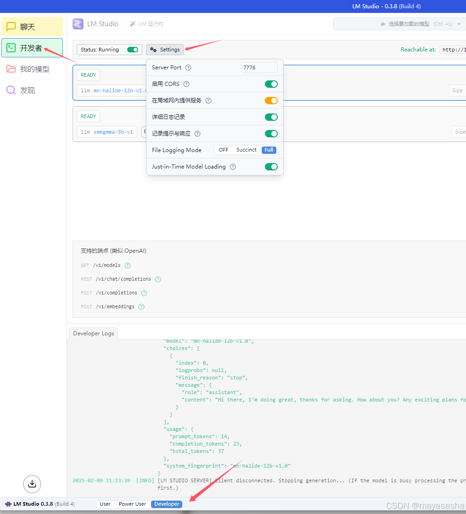
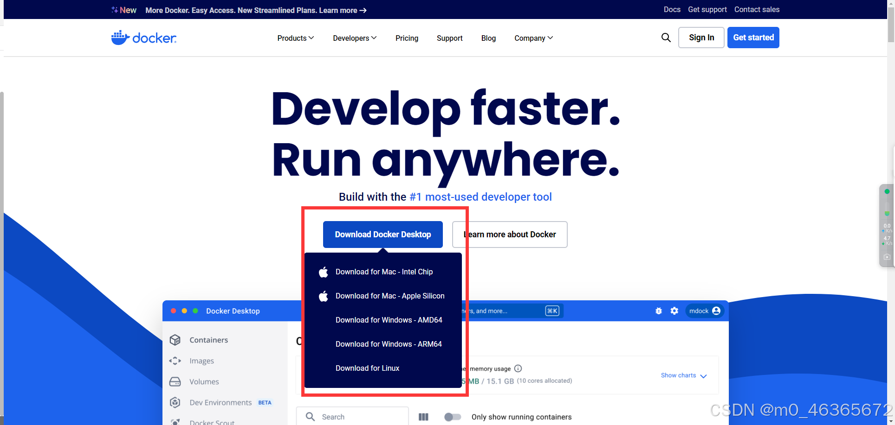
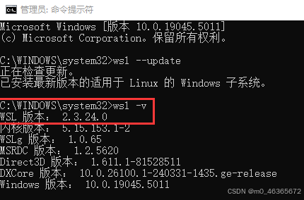
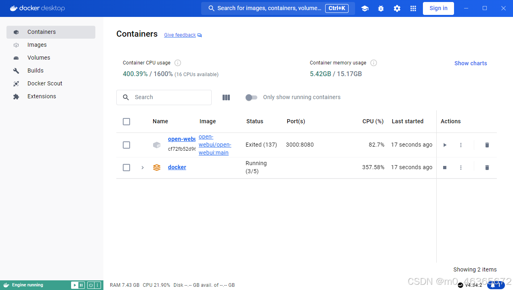
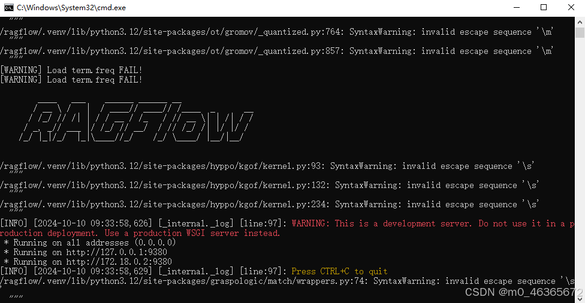
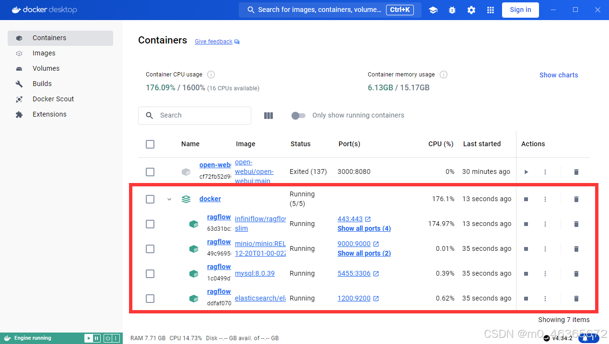
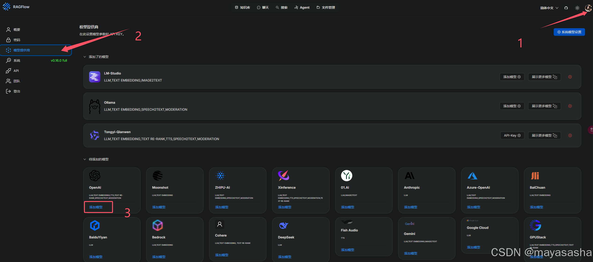
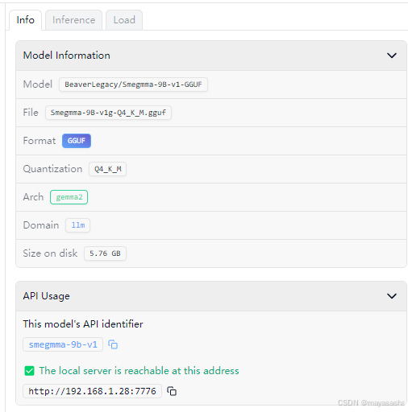
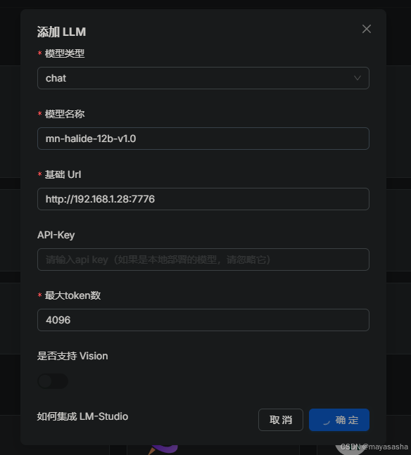

## 1、LM Studio安装

模型下载`bge-large-zh-v1.5`和`DeepSeek-R1-Distill-Llama-8B`

在Developer启动本地服务并加载两个模型



## 2、RAGFlow的docker容器部署

#### 1、docker desktop的下载安装

（1）进入docker官网：https://www.docker.com/，下载适合自己电脑的版本

（2）下载完成后双击installer完成安装
安装完docker出现Engine stopped：
建议在运行docker安装前先检查自己电脑的hyper-v有没有正常打开，同时检查自己的WSL有没有升级到WSL2，确保Hyper-v打开和WSL升级到WSL2再运行docker installer，一般这样就能正常打开docker desktop了。
WSL升级：用管理员身份运行打开Power Shell，执行 `wsl --update`
系统就会开始自动升级到WSL2，升级完后可以执行： `wsl -v` 检查结果

Hyper-v和WSl2都正常的情况下运行刚刚下载的docker installer，docker左下角显示“Engine running”代表正常


#### 2、RAGFlow的拉取运行

git克隆仓库完成拉取

```bat
git clone https://github.com/infiniflow/ragflow.git
```

运行

```bat
cd ragflow/docker
docker compose up -d
```

完成后运行检查服务器状态

```bat
docker logs -f ragflow-server
```

有类似下图输出并且无报错即可

此时docker中也可以看到容器正常运行起来了


在浏览器网址栏输入`localhost/knowledge`或`localhost:80`即可访问RAGFlow开始使用

## 3、RAGFlow配置

选择头像来到模型提供商，找到lm studio添加模型



点击添加模型

模型类型选择chat，名称和基础url复制lm开发者页面的api usage





同样方法添加Embedded Model，模型类型选择Embedded。

添加完成后在RAGFlow右上角修改系统模型设置

如果添加模型遇到102的报错：102 Fail to access model(Smegmma-9B-v1g-Q4_K_M).'NoneType' object is not subscriptable

将基础Url改为：http://host.docker.internal:1234
