## 一、环境配置

### 1.连接服务器

使用SSH连接服务器的公网IP，记得在服务器详情页进行服务器密码的重置。

### 2.宝塔面板的安装

宝塔面板是一款服务器管理软件，支持Windows和Linux系统，可以通过web端轻松管理服务器，提升运维效率，该软件内置了创建管理网站、FTP、数据库、可视化文件管理器、可视化软件管理器等等。安装宝塔面板的目的就是更简单的管理网站服务器。

**Centos安装命令**

 ```shell
 url=https://download.bt.cn/install/install_panel.sh;if [ -f /usr/bin/curl ];then curl -sSO $url;else wget -O install_panel.sh $url;fi;bash install_panel.sh ed8484bec
 ```

**Ubuntu/Deepin安装命令**

 ```shell
 wget -O install_panel.sh https://download.bt.cn/install/install_panel.sh && sudo bash install_panel.sh ed8484bec
 ```

安装完成之后会输出宝塔的外网面板和内网面板的地址以及账号和密码，可以直接使用外网地址然后输入账号密码进行访问。若是误删了给出的账号和密码，可以使用如下命令重新输出地址以及账号密码。

建议使用 bt 指令更改用户名和密码，也可以在宝塔面板设置界面设置账号和密码。

 ```shell
 bt default
 ```

使用如下命令可以修改密码。

 ```shell
 bt 5
 ```

### 3.云服务器安全组打开端口

出于安全考虑，阿里云服务器端口默认是白名单模式，有些端口默认是关闭的，需要手动开启。云服务器ECS在安全组中开启端口，轻量应用服务器在防火墙中打开端口。在云服务器上安装宝塔面板后，需要打开宝塔面板所依赖的端口号，否则面板无法正常使用，以前宝塔默认端口号是8888，出于安全考虑，宝塔面板在安装完毕后，会随即生成端口号，如上图所示。
1、登录到云服务器ECS管理控制台

2、左侧栏找到【实例与镜像】>>【实例】，找到目标ECS实例，点击实例ID进入到实例详情页

3、切换到【安全组】页面，点击右侧【管理规则】，如下图：


4、在入方向点击【快速添加】，端口范围中勾选所有项，点击确定。

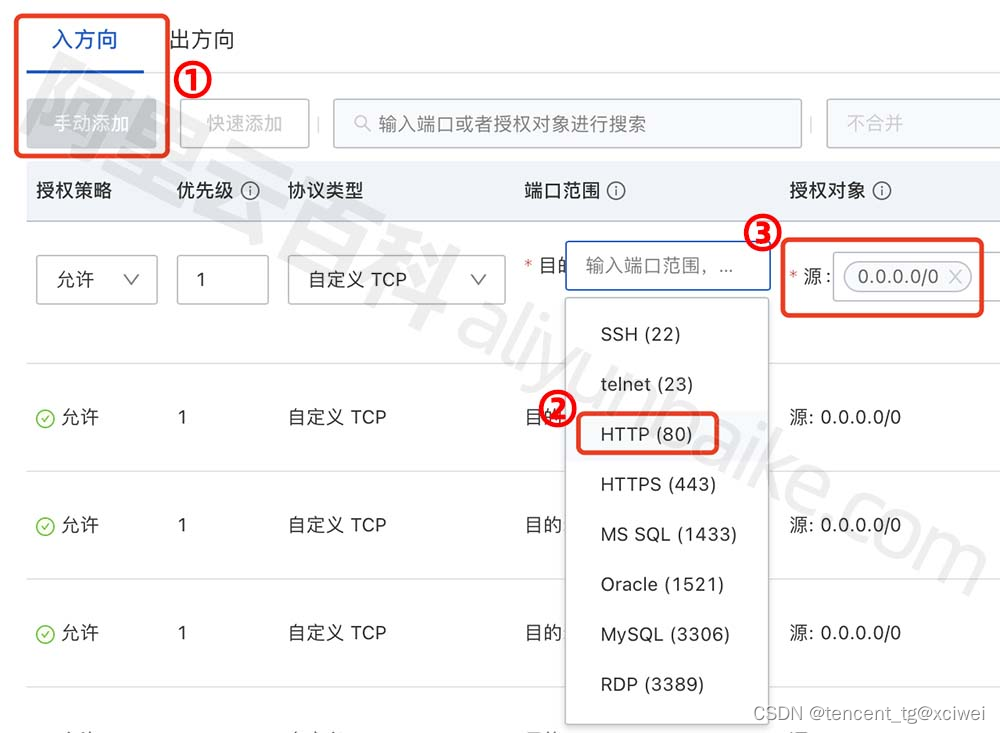

同理，开通哪个端口号，就在端口范围中输入对应的端口号。最后保存即可生效，不需要重启。

### 4.宝塔面板基本配置

直接复制宝塔面板的外网访问地址进入登陆页面，使用账号密码进行登陆，成功进入后会建议进行常用软件的安装，建议选择LNMP安装，如图所示：

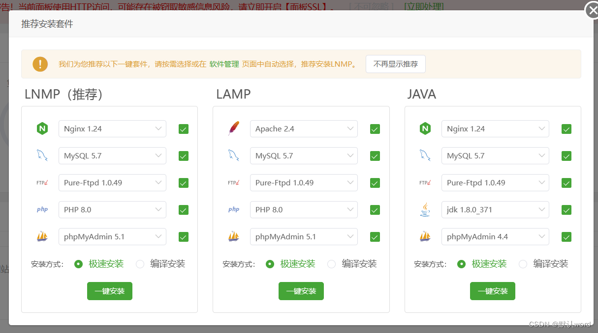

### 5.Docker的安装

本文章只记录Ubuntu上的安装过程，建议去https://docs.docker.com/engine/install上详细查询其他系统如何安装。

#### 1.卸载旧版本

在安装Docker之前需要卸载旧版本的Docker以及依赖项，如若第一次安装，请跳过。

```shell
for pkg in docker.io docker-doc docker-compose docker-compose-v2 podman-docker containerd runc; do sudo apt-get remove $pkg; done
```

#### 2.设置apt存储库

在新的主机上首次安装 Docker Engine 之前，您需要设置 Docker`apt`存储库。之后，您可以从存储库安装和更新 Docker。

 ```shell
 # Add Docker's official GPG key:
 sudo apt-get update
 sudo apt-get install ca-certificates curl
 sudo install -m 0755 -d /etc/apt/keyrings
 sudo curl -fsSL https://download.docker.com/linux/ubuntu/gpg -o /etc/apt/keyrings/docker.asc
 sudo chmod a+r /etc/apt/keyrings/docker.asc
 
 # Add the repository to Apt sources:
 echo \
   "deb [arch=$(dpkg --print-architecture) signed-by=/etc/apt/keyrings/docker.asc] https://download.docker.com/linux/ubuntu \
   $(. /etc/os-release && echo "${UBUNTU_CODENAME:-$VERSION_CODENAME}") stable" | \
   sudo tee /etc/apt/sources.list.d/docker.list > /dev/null
 sudo apt-get update
 ```

#### 3.安装Docker

安装 Docker Engine、containerd 和 Docker Compose：

 ```shell
 sudo apt-get install docker-ce docker-ce-cli containerd.io docker-buildx-plugin docker-compose-plugin
 ```

此命令安装 Docker，但不会启动 Docker。它还会创建一个组，但是，默认情况下它不会向组添加任何用户。

#### 4.启动Docker

 ```shell
 sudo systemctl start docker
 ```

可以通过运行映像来验证 Docker 引擎安装是否成功。

 ```shell
 sudo docker run hello-world
 ```

#### 5.配置Docker Hub镜像加速

https://gitee.com/wanfeng789/docker-hub

> Ubuntu 16.04+、Debian 8+、CentOS 7+

创建或修改 `/etc/docker/daemon.json`：

```shell
sudo mkdir -p /etc/docker

sudo tee /etc/docker/daemon.json <<EOF
{
    "registry-mirrors": [
        "https://docker.1ms.run",
        "https://hub.rat.dev",
        "https://docker.1panel.live"
    ]
}
EOF

sudo systemctl daemon-reload
sudo systemctl restart docker
```

## 二、网站搭建

使用宝塔面板部署Flask项目

### 1.本地Flask项目上传

flask项目中必须包含一个文件requirements.txt，用于写明项目所需要的Python包，否则后续部署项目时会报错。

压缩后通过宝塔面板上传到服务器`/www/wwwroot`目录下，并解压。

### 2.安装Python

在Python项目管理器里安装自己项目所需要的Python版本

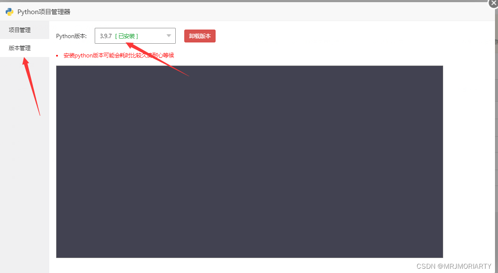

### 3.添加flask项目到Python项目

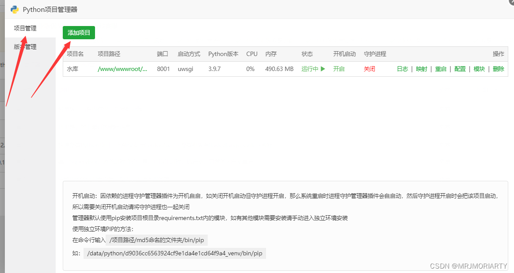

添加时选择安装依赖包，会根据`requirements.txt`在虚拟环境中安装依赖。如果未选择，也可在终端手动安装

```shell
#使用：" source py-project-env <project_name> "启动虚拟环境
cd /www/wwwroot/FlaskProject
source py-project-env FlaskProject
pip install -r ./requirements.txt
#使用：" deactivate "命令, 退出虚拟环境, 回到之前的环境
```

配置如图

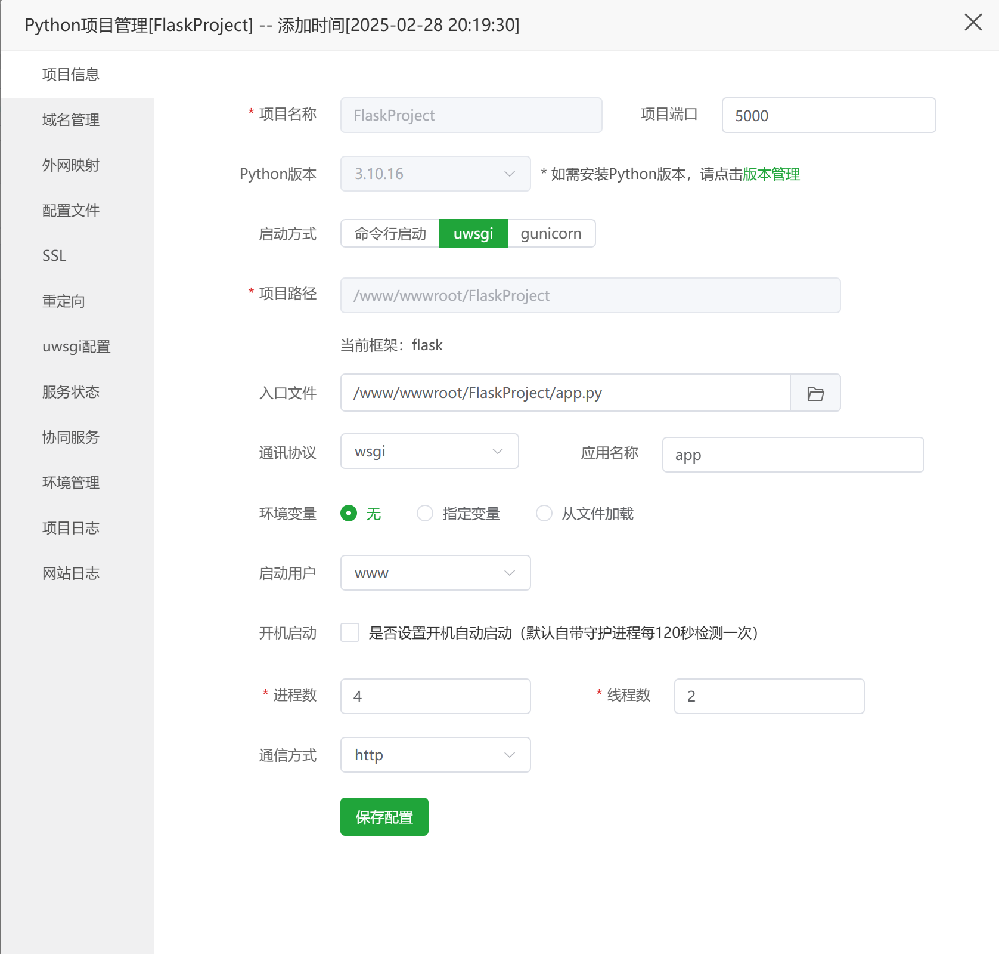

项目名称：在宝塔面板内显示的名字

项目路径：Flask项目的根路径

项目端口：后端Flask的端口，自己设置(注意：由于我们的后端是在内网条件下运行，这个端口也是内网端口，不同于前端的外网端口)

入口文件：选择project目录下的flask的.py文件，我的是app.py

端口设置为5000，flask默认端口

### 4.设置Nginx

修改Nginx配置文件，找到server部分，修改server_name为自己服务器的公网ip或自定义域名

修改root为自己的项目目录

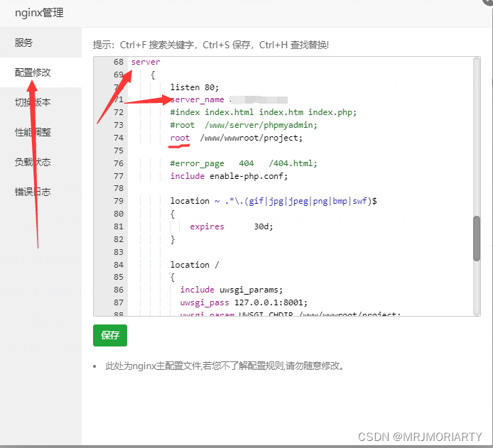

### 5.放行端口

（1）在自己的服务器添加安全组并放行对应的端口

（2）在宝塔里面放行相应的端口

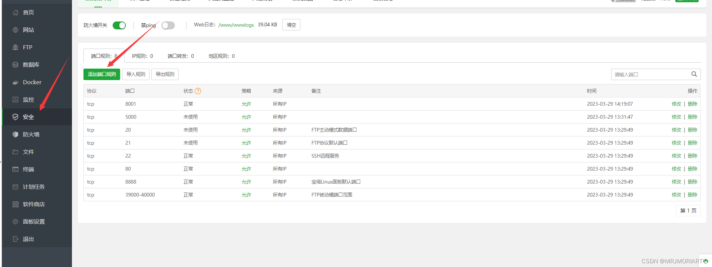

 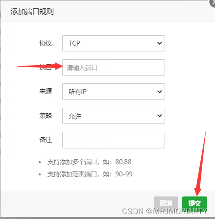

尽量这些都放行

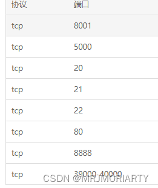

至此，flask项目部署完毕，现在可以通过服务器IP地址访问自己的项目了

### 6.自定义域名并申请SSL证书

进入SSL设置，申请Let's Encrypt证书

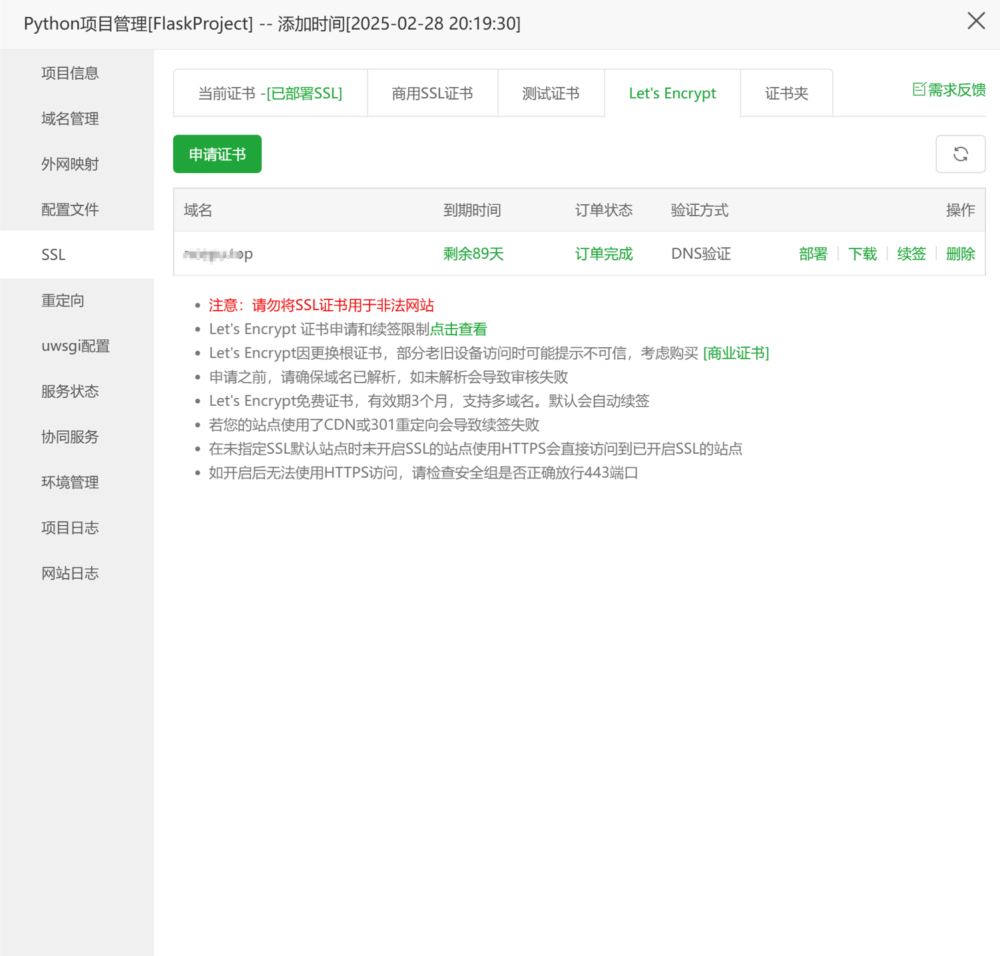

点击申请证书--DNS验证，选择手动解析，勾选域名，点击申请证书。

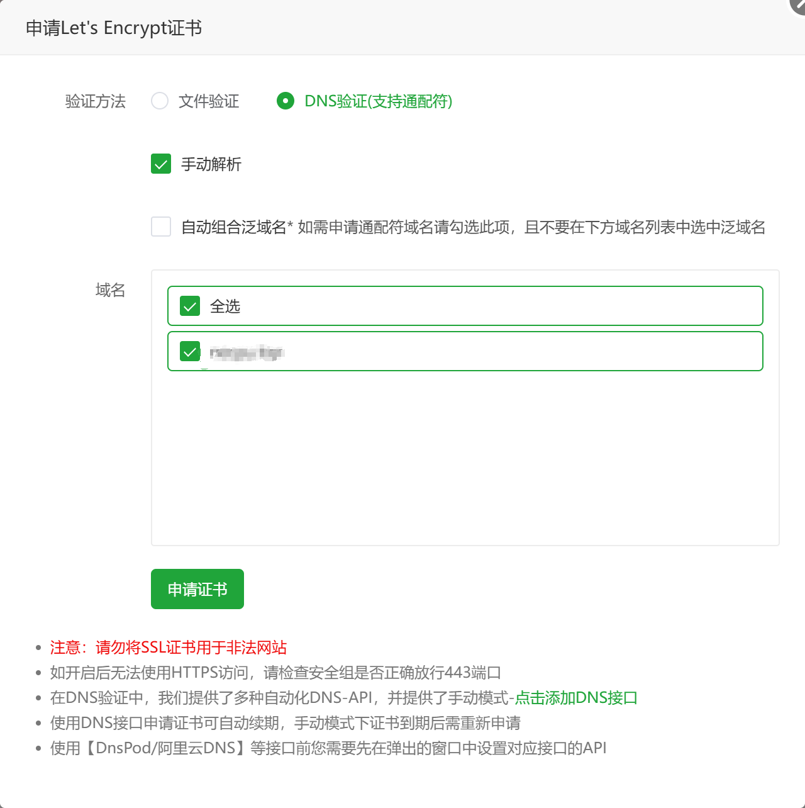

按照列表手动设置域名的DNS解析，以Cloudflare为例

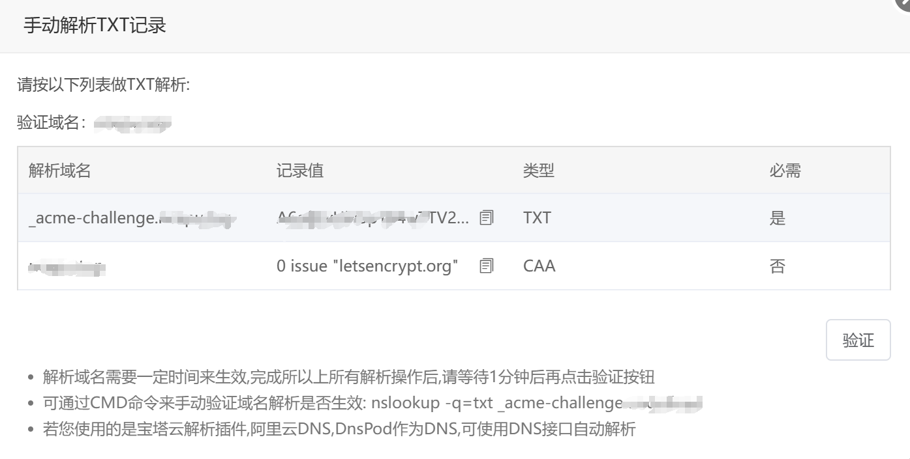

在Cloudflare的DNS设置界面按照以下方式设置：

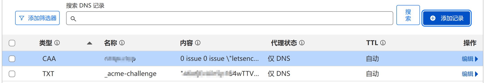

配置完成后点击验证，即可成功申请。

> 参考链接：
>
> [最简单最详细的宝塔部署flask教程_宝塔部署flask项目-CSDN博客](https://blog.csdn.net/MRJMORIARTY/article/details/129855898)
>
> [Flask+Vue3+宝塔面板部署前后端_flask vue3-CSDN博客](https://blog.csdn.net/zheshiyangyang/article/details/143913183)
